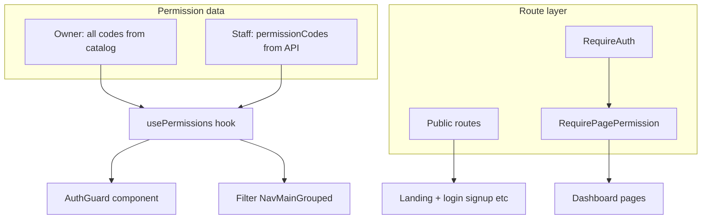

# prompt

i want to implement role based authentication with auth guard. i've drawn up
a plan gym_web_rbac_guards_a0712a2f.plan.md,. go through it and go through
the app and the necessary md files and then say where the plan falls short.

---

name: Gym web RBAC guards
overview: Add session bootstrap, route-level authentication, a permission-aware `AuthGuard` with optional fallback UI, page-level route gates (toast/dialog + redirect to `/profile`), and permission-filtered sidebar navigation—using `ROLES_AND_PERMISSIONS.json` codes, with gym owners treated as having all permissions and staff loading explicit `permissionCodes` from the profile API once available.
todos:

- id: session-bootstrap
  content: Restore auth state from localStorage token + profile fetch; align 401/logout with store
  status: pending
- id: require-auth-routes
  content: Wrap non-public routes in RequireAuth; redirect to /login with return URL
  status: pending
- id: use-permissions
  content: "Implement usePermissions: owner = all JSON codes, staff = profile.permissionCodes when present"
  status: pending
- id: auth-guard
  content: Add AuthGuard (permissions, mode all|any, optional fallback); no role passed to children
  status: pending
- id: page-permission-map
  content: Add route→permission map + RequirePagePermission (toast/dialog + redirect /profile)
  status: pending
- id: nav-filter
  content: Refactor NavMainGrouped to declarative items filtered by permissions; hide empty groups
  status: pending
- id: subscription-profile-allowlist
  content: Allow /profile through AppSidebar subscription redirect (or agreed alternative)
  status: pending
- id: wire-features
  content: Apply AuthGuard to tables/filters and action buttons per ROLES_AND_PERMISSIONS.md
  status: pending
  isProject: false

---

# Protected routes and RBAC guards (activehive-gym-web)

## Current state (from codebase)

- [App.tsx](activehive-gym-web/src/App.tsx) registers **all routes as public**; there is no auth wrapper.
- [auth.store.ts](activehive-gym-web/src/store/auth.store.ts) persists **only the token** in `localStorage`; `**isAuthenticated` is not restored on refresh (Zustand resets), while [api-client.ts](activehive-gym-web/src/lib/api-client.ts) still sends the token—so users can appear “logged out” in UI while API calls work.
- [UserProfile](activehive-gym-web/src/features/profile/types/index.ts) has `role` but **no `permissionCodes`** yet; staff RBAC in the app already uses `**code` strings aligned with [ROLES_AND_PERMISSIONS.json](activehive-gym-web/ROLES_AND_PERMISSIONS.json) (see [staff types](activehive-gym-web/src/features/staff/types/index.ts)).
- [NavMainGrouped](activehive-gym-web/src/components/layout/nav-main-grouped.tsx) is **static**; no permission filtering.
- [AppSidebar](activehive-gym-web/src/features/dashboard/components/app-sidebar.tsx) redirects non-`/billing` routes to `/billing` when there is no active subscription—`**/profile` is not exempt**, so a permission-denied redirect to `/profile` can conflict with this unless `**/profile` is allowlisted (recommended).

## Architecture



###1) Session bootstrap and “logged in” definition

- Add a small **bootstrap** step (e.g. `AuthBootstrap` in [main.tsx](activehive-gym-web/src/main.tsx) or inside `App`): if `activehive_token` exists, set Zustand `isAuthenticated` and optionally **hydrate `AuthUser`** via existing `GET /api/profile` (same as [useProfileQuery](activehive-gym-web/src/features/profile/services/queries.ts)).
- **Logout / 401**: ensure [api-client](activehive-gym-web/src/lib/api-client.ts) interceptor clears token and auth store consistently (if not already) so guards stay in sync.

### 2) Route classification**Public (no token):** `/`, `/login`, `/signup`, `/forgot-password`, `/otp` (adjust if OTP must stay semi-public).

**Authenticated (token required):** everything else, including onboarding paths (`/complete-setup`, `/pending-approval`, `/gym-branding`, `/compliance-documents`, `/gym-locations`), `/dashboard/`, `/profile`, `/billing`.

Implementation pattern: wrap authenticated routes in a `**RequireAuth` component (`Navigate` to `/login` with optional `state.from` / query `returnTo` for post-login redirect).

### 3) Effective permissions (`usePermissions`)

- **Gym owner (your choice):** build `Set<string>` = **all `code` values** from [ROLES_AND_PERMISSIONS.json](activehive-gym-web/ROLES_AND_PERMISSIONS.json) when `UserProfile.role` (or equivalent) indicates owner—**no API list required** for owners.
- **Staff:** `permissionCodes` from `**GET /api/profile`** (or a dedicated `/me/permissions` if you prefer). **Backend contract:** extend profile JSON with optional `permissionCodes: string[]` for staff; until the API ships, staff can resolve to **empty set (strict: hides everything except pages you exempt) or a dev-only flag—call this out during implementation.
- Export helpers: `hasPermission(code)`, `hasAll(codes)`, `hasAny(codes)`.

### 4) `AuthGuard` component (UI-level)

New file e.g. [activehive-gym-web/src/features/auth/components/auth-guard.tsx](activehive-gym-web/src/features/auth/components/auth-guard.tsx) (or `components/auth/`):

- **Props:** `permissions: string[]`, optional `mode?: "all" | "any"` (**default `"all"`**—safer for compound checks), optional `fallback?: ReactNode`, `children`.
- **Behavior:** compute allowed from `usePermissions()` only; **do not pass role or permission props to `children`** (render `children` as-is when allowed).
- **Default fallback when denied and no `fallback`:** render `**null`** (for buttons/sections). For list pages, callers pass a **centered fallback (reuse existing empty-state / typography patterns from the app).

### 5) Page-level permissions (nav + deep links)

**Single source of truth:** a small **route → required permission** map (e.g. `src/features/auth/lib/page-permissions.ts`) derived from [ROLES_AND_PERMISSIONS.md](activehive-gym-web/ROLES_AND_PERMISSIONS.md) “view” / entry permissions, for example:

| Path pattern                                               | Primary permission                                                                       |
| ---------------------------------------------------------- | ---------------------------------------------------------------------------------------- |
| `/dashboard`                                               | `dashboard.view`                                                                         |
| `/dashboard/check-in`                                      | `check-in.view`                                                                          |
| `/dashboard/gym-profile`                                   | `gym-management.view-gym-profile`                                                        |
| `/dashboard/members`                                       | `members.view`                                                                           |
| `/dashboard/members/new`                                   | `members.create`                                                                         |
| `/dashboard/members/:id`                                   | `members.view-details`                                                                   |
| `/dashboard/members/:id/edit`                              | `members.edit`                                                                           |
| `/dashboard/membership-plans`                              | `membership-plans.view`                                                                  |
| `/dashboard/subscriptions`                                 | `subscriptions.view`                                                                     |
| `/dashboard/subscriptions/:id`                             | `subscriptions.view-details`                                                             |
| `/dashboard/trainers`                                      | `trainers.view`                                                                          |
| `/dashboard/trainers/assignments`                          | `trainers.assignments.view`                                                              |
| `/dashboard/classes`                                       | `classes.view`                                                                           |
| `/dashboard/classes/attendance`                            | `classes.attendance.view`                                                                |
| `/dashboard/classes/:id`                                   | `classes.view-details`                                                                   |
| `/dashboard/payments/transactions`                         | `payments.view-transactions`                                                             |
| `/dashboard/marketing/`                                    | `marketing.view` plus child route codes (e.g. promo list → `marketing.promo-codes.view`) |
| `/dashboard/staff`                                         | `staff.users.view`                                                                       |
| `/dashboard/staff/roles`                                   | `staff.roles.manage`                                                                     |
| `/dashboard/locations`                                     | `locations.view`                                                                         |
| `/dashboard/locations/new` (+ typo path)                   | `locations.create`                                                                       |
| `/dashboard/locations/:id` (+ facilities, operating-hours) | `locations.view-details` / `gym-management.view-operating-hours` / edit split as needed  |

**Exempt from page permission map:** `/profile` (authenticated only), `/billing` (no code in JSON today—**auth-only** unless you add a permission later), onboarding routes.

`**RequirePagePermission` wrapper:

- If user lacks the mapped permission: `**useToast` message** (and optional **AlertDialog** if you want an explicit “OK” acknowledgment), then `**navigate("/profile", { replace: true })`.
- Run **after** `RequireAuth` and ideally **after** subscription logic is settled (see below).

**Navbar:** refactor [nav-main-grouped.tsx](activehive-gym-web/src/components/layout/nav-main-grouped.tsx) to use **declarative items** `{ title, href, permission(s) }` and **filter** with `usePermissions()`. Hide **entire groups** when every child is hidden. Top-level links (Dashboard, Check-In, Gym Profile) get the same permission fields.

### 6) Subscription gate vs permission gate

- Update [app-sidebar.tsx](activehive-gym-web/src/features/dashboard/components/app-sidebar.tsx) **allowlist** to include `**/profile` so “no permission” redirects remain usable even without an active subscription (or document an alternative redirect).
- Order of checks: **auth → subscription (existing) → page permission** to avoid confusing redirects.

### 7) Wiring UI to permissions (incremental but systematic)

- **List / table screens:** wrap **filters + table** in one `AuthGuard` with a shared `**fallback` (centered “You don’t have access… contact your admin”).
- **Actions:** wrap primary buttons (Create, Edit, Delete, etc.) with `AuthGuard` and **narrow** permission codes from the catalog (e.g. `members.create`, `membership-plans.update`).
- **Staff permissions UI:** [permissions page route is currently disabled](activehive-gym-web/src/app/dashboard/staff/permissions/page.disabled.tsx); when re-enabled, gate with `staff.permissions.manage`.

This is a large surface area; implement **infrastructure first** (bootstrap, `RequireAuth`, `usePermissions`, `AuthGuard`, nav filter, page guard + map), then **feature-by-feature** using the `.md` file as the checklist.

### 8) Types and API

- Extend `UserProfile` with optional `permissionCodes?: string[]` when backend is ready.
- Optionally add `usePermissionCodesQuery` that shares the profile query key to avoid duplicate fetches.

## Testing checklist

- Logged out: dashboard URL → login.
- Refresh with token: still treated as logged in; guards work.
- Owner: sees full nav; staff with subset: nav and pages match.
- Deep link to forbidden page: toast/dialog → `/profile`.
- Table page without list permission: filters+table replaced by fallback message.

```

```
